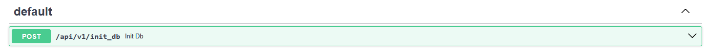

# test_moon

## Описание проекта 🌓

- REST API для управления организациями, их зданиями и видами деятельности.
- Проект реализован по собственной интерпретации паттерна репозиторий и луковой архитектуры, хотя местами я уходил от этого. НО старательно пытался реализовать относительно чистую архитектуру проекта.
- dataclass, Redis и тем более RabbitMQ не использовал ввиду их крайней избытычности для столь мелкого проекта, но если потребуется что-либо переделать, то пишите!

- По любым вопросам по коду, писать в телеграмм, который указан в конце документа
---

## Шаги установки 🚀
1. **Склонируйте репозиторий**:
```bash
    git clone https://github.com/gol43/test_moon.git   

    cd test_moon
```

2. **Создайте и активируйте виртуальное окружение**:
```bash
    python -m venv venv

    source venv/bin/activate
```

3. **Установите зависимости**:
```bash
    pip install -r requirements.txt
```

---

## Примеры запуска 🧰

1. **Создать файл .env в корне с данными (пример)** ⚙️
```bash
POSTGRES_USER=postgres
POSTGRES_PASSWORD=1234
POSTGRES_DB=test_moon
POSTGRES_HOST=db
POSTGRES_PORT=5432
DATABASE_URL=postgresql+asyncpg://${POSTGRES_USER}:${POSTGRES_PASSWORD}@${POSTGRES_HOST}:${POSTGRES_PORT}/${POSTGRES_DB}
```

2. **Создание образов и запуск контейнера** 🐳
```bash
docker compose up -d
```

3. **Создание миграций и их применение**
```bash
docker exec -it test_moon_api bash

alembic revision --autogenerate -m "initial"

alembic upgrade head
```

4. **Инициализация тестовых данных для БД** 🌱

Нужно перейти по ссылке swagger: http://127.0.0.1:8000/api/v1/moon/docs#/

И найти в самом низу ручку инициализации проекта и исполнить её:



5. **Особенность проверки ручки /api/v1/organizations/by_geo**
Вот пример проверки данной ручки:
- При таких зданиях: 
```bash
[
  {
    "id": 1,
    "address": "ул. Ленина, д.1",
    "coordinates": {"lat": 54.7104, "lon": 20.5110}
  },
  {
    "id": 2,
    "address": "ул. Пушкина, д.5",
    "coordinates": {"lat": 54.7200, "lon": 20.5200}
  },
  {
    "id": 3,
    "address": "ул. Гагарина, д.10",
    "coordinates": {"lat": 54.7300, "lon": 20.5300}
  }
]
```

- Используйте следующие координаты:
```bash
lat_min = 54.7150
lon_min = 20.5000
lat_max = 54.7250
lon_max = 20.5250
```

--- 

## 👨‍💻 Автор

Проект разработан:  
**Сайгушев Дамир Даниярович**  
- GitHub: [gol43](https://github.com/gol43)  
- Telegram: [@spongedmw](https://t.me/spongedmw)

---
